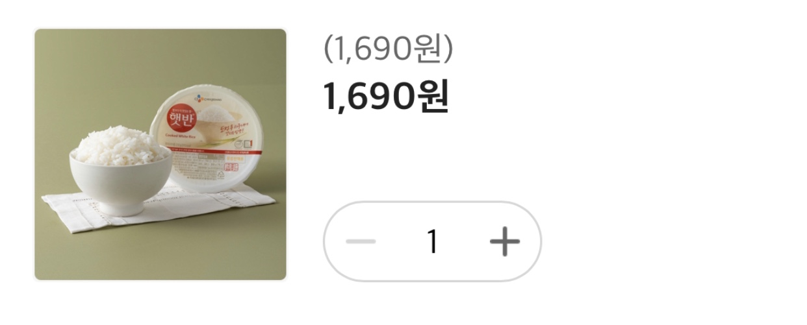

> 이전 포스트
> [모바일 웹뷰를 탐험하는 개발자를 위한 안내서 (상)](https://vallista.kr/2019/11/10/%EB%AA%A8%EB%B0%94%EC%9D%BC-%EC%9B%B9%EB%B7%B0%EB%A5%BC-%ED%83%90%ED%97%98%ED%95%98%EB%8A%94-%EA%B0%9C%EB%B0%9C%EC%9E%90%EB%A5%BC-%EC%9C%84%ED%95%9C-%EC%95%88%EB%82%B4%EC%84%9C-%EC%83%81/)

저번 시간에는 자주 나오는 레이아웃 깨지는 이슈에 대응하는 방법을 알아보았습니다. 이번 시간에는 자주 나오지는 않지만 한번 나오면 대응하기 힘든 이슈와 자주 사용하는 HTML, CSS 코드 이야기를 하려고 합니다.

## 이미지를 디바이스 크기 상관없이 대응하는 두 가지 방법

반응형 웹을 개발할 때, 이미지를 fill(가득 채우는) 처리를 해야할 상황이 항상 오기 마련입니다. 그럴때 아래와 같은 방법을 자주 사용했습니다.

```html
<div class="title-image"></div>
```

```css
/* CSS 축약 사용 */
.title-image {
  background: black url('example.png') no-repeat cover center;
}

/* 모든 Property 사용 */
.title-image {
  background-image: url('example.png');
  background-repeat: no-repeat;
  background-size: cover;
  background-position: center;
}
```

`background` Property를 사용한 방법은 과거부터 전통적으로 웹 프론트엔드를 개발하면서 사용되던 형태입니다. 하지만 이 방법은 `Semantic Web(시맨틱 웹)`이 대두되면서 html을 작성하는 명확한 방법이 아니게 되어 현재 와서는 권장이 되지 않고 있습니다. 그래서 아래와 같은 방법을 사용합니다.

```html

```

```css
.title-image {
  object-fit: cover;
  object-position: center;
}
```

이 형태의 작성 방법은 `Semantic Web(시멘틱 웹)`을 보장함과 동시에, CSS 코드도 간결해진다는 장점을 가지고 있습니다. 하지만, 이 방법에도 단점이 존재합니다.


모든 브라우저가 지원하지 않는다.

그렇습니다. 이 방법은 모든 브라우저가 지원을 하지 않습니다. (IE 11 미지원) 그렇기 때문에 Cross Browsing 이슈가 존재합니다. 그렇기 때문에 Polyfill을 사용해야 하는데 이는 Webpack과 함께 자주 사용되는 PostCSS 모듈 **Autoprefixer**에 포함되어 있으므로 걱정을 하지 않으셔도 됩니다. 만약 포함이 안되어있다면 Autoprefixer를 포함해주세요.

- [Autoprefixer object-fit, object-position 적용 커밋](https://github.com/ai/autoprefixer-core/commit/26d0c8f18380508725f417eed0562f288e117deb)
- [Autoprefixer](https://github.com/postcss/autoprefixer)

> Polyfill이란?
> Polyfill은 개발자가 특정 기능이 지원되지 않는 브라우저를 위해 사용할 수 있는 코드 조각이나 플러그인을 말합니다.

> background-size, object-fit의 두 가지 옵션
> 이미지를 확대할 때, 가로를 기준으로 확대를 할 지 세로를 기준으로 확대 할 지 설정할 수 있습니다.
>
> 


## 이미지의 위치를 침범하는 이슈

아래와 같은 레이아웃을 구현한다고 가정해봅시다.



이 레이아웃을 구현하는 여러가지 방법이 존재할텐데 그 중에서 한 가지 방법을 이야기 해보겠습니다.

```html
<div class="container">
  <div class="left-area">
    
  </div>
  <div class="right-area">
    <div class="price-wrapper">
      <span class="gray">(1,690원)</span>
      <span class="black">1,690원</span>
    </div>
    <div class="box">
    </div>
  </div>
</div>
```

```css
.container {
  display: flex;
  flex-direction: row;
  justify-content: center;
  align-items: center;
  width: 100vw;
  height: 200px;
  box-sizing: border-box;
  padding: 24px 12px 24px 12px;
}

.left-area {
  width: 140px;
  height: 140px;
}

.image {
  border-radius: 6px;
}
```

구글 크롬 및 데스크톱에서는 코드가 제대로 동작하는 걸 확인할 수 있습니다. 하지만 갤럭시 S3와 같은 디바이스에서 코드를 실행시키면, `right-area`에 있는 레이아웃이 이미지 영역으로 침범하게 됩니다. 그렇다면 어떻게 해야할까요? 바로, CSS의 `Calc`를 사용하면 됩니다. CSS에서 아래와 같이 추가를 해주세요.

```css
...

.right-area {
  width: calc(100% - 140px);
}
```

`right-area`에 `width: calc(100% - 140px)`를 추가하면 영역을 침범하지 않고 정상적으로 출력되는 걸 볼 수 있습니다.

> ``태그를 사용하여 HTML 코드를 작성할 때, width와 height중 한 값은 기본적으로 설정하는 게 좋습니다. (width를 설정하고 height를 auto로 설정하는게 무난합니다.)

## overflow: scroll; 옵션이 iOS에서 적용이 안되는 이슈

스크롤이 되는 레이아웃을 작성해야할 때, 아래와 비슷한 형태의 코드를 입력하여 구현합니다.

```html
<div class="overflow-layer">
  <div class="row"><p>블라블라블라블라블라블라블라블라블라블라블라블라<p></div>
  <div class="row"><p>블라블라블라블라블라블라블라블라블라블라블라블라<p></div>
  <div class="row"><p>블라블라블라블라블라블라블라블라블라블라블라블라<p></div>
  <div class="row"><p>블라블라블라블라블라블라블라블라블라블라블라블라<p></div>
  <div class="row"><p>블라블라블라블라블라블라블라블라블라블라블라블라<p></div>
  <div class="row"><p>블라블라블라블라블라블라블라블라블라블라블라블라<p></div>
  <div class="row"><p>블라블라블라블라블라블라블라블라블라블라블라블라<p></div>
  <div class="row"><p>블라블라블라블라블라블라블라블라블라블라블라블라<p></div>
  <div class="row"><p>블라블라블라블라블라블라블라블라블라블라블라블라<p></div>
  <div class="row"><p>블라블라블라블라블라블라블라블라블라블라블라블라<p></div>
  <div class="row"><p>블라블라블라블라블라블라블라블라블라블라블라블라<p></div>
  <div class="row"><p>블라블라블라블라블라블라블라블라블라블라블라블라<p></div>
</div>
```

```css
.overflow-layer {
  width: 100%;
  height: 400px;
  overflow: scroll;
}

.row {
  color: #e6e6e6;
}
```

이렇게 작성하여 데스크톱 웹에서 동작시키면 정상적으로 동작하는 걸 볼 수 있습니다. 하지만 iOS에서 동작시키면 `400px`의 레이어 안에 엄청 조밀하게 텍스트가 중첩되어 나오는 걸 확인할 수 있습니다.

이는 제대로 `overflow: scroll;` 옵션이 적용이 안되었기 때문이 아닙니다. iOS에서는 기본적으로 Scroll Layer를 구현 해야할 때 리스트 형태를 권장하기 때문입니다. 아래와 같이 코드를 변경해주세요.

```html
<div class="overflow-layer">
  <ul>
    <li class="row"><p>블라블라블라블라블라블라블라블라블라블라블라블라<p></li>
    <li class="row"><p>블라블라블라블라블라블라블라블라블라블라블라블라<p></li>
    <li class="row"><p>블라블라블라블라블라블라블라블라블라블라블라블라<p></li>
    <li class="row"><p>블라블라블라블라블라블라블라블라블라블라블라블라<p></li>
    <li class="row"><p>블라블라블라블라블라블라블라블라블라블라블라블라<p></li>
    <li class="row"><p>블라블라블라블라블라블라블라블라블라블라블라블라<p></li>
    <li class="row"><p>블라블라블라블라블라블라블라블라블라블라블라블라<p></li>
    <li class="row"><p>블라블라블라블라블라블라블라블라블라블라블라블라<p></li>
    <li class="row"><p>블라블라블라블라블라블라블라블라블라블라블라블라<p></li>
    <li class="row"><p>블라블라블라블라블라블라블라블라블라블라블라블라<p></li>
    <li class="row"><p>블라블라블라블라블라블라블라블라블라블라블라블라<p></li>
    <li class="row"><p>블라블라블라블라블라블라블라블라블라블라블라블라<p></li>
  </ul>
<div>
```

ios에서는 스크롤 영역을 지정할 때 list-item 기준으로 content 사이즈를 지정합니다. 그렇기 때문에 ul, li 와 같은 list 태그들로 감싸주어야 column 형태의 스크롤 레이아웃이 생성됩니다.

## Position Property의 Relative와 Absolute

CSS의 Position Property는 CSS 요소가 화면에 어떻게 배치될 지를 설정하는 역할을 합니다. 옵션 중 저번 글에서 언급했던 `display: fixed` 옵션은 iOS에서 제대로 된 동작을 하지 않기 때문에 absolute와 relative 두 요소를 제일 많이 사용할 것 입니다. 아래의 사용 예제를 보도록 합시다.

```html
<div class="modal-layer">
  <div class="modal-wrapper">
    <div class="modal">
      <p>안녕하세요.</p>
    </div>
  </div>
</div>
```

```css
.modal-layer {
  width: 100vw;
  height: 100vh;
}

.modal-wrapper {
  width: 100vw;
  height: 100vh;
  background-color: rgba(0, 0, 0, 0.5);
}

.modal {
  position: absolute;
  left: 50%;
  top: 50%;
  transform: translate(-50%, -50%);
  width: 200px;
  height: 200px;
  z-index: 50;
}
```

absolute는 기존에 있는 요소의 z-index를 부여하여 더 높은 우선순위로 그려지도록 설정합니다. 그렇기 때문에 modal과 같은 안내 레이아웃에 적합한 Property 입니다. 그렇다면 위의 예제를 실행해볼까요? Desktop 크롬에서는 제대로 나오겠지만 안드로이드, iOS에서는 제대로 된 위치에서 그려지지 않을겁니다. 그렇기 때문에 아래와 같이 작성해주어야 합니다.

```css
.modal-layer {
  width: 100vw;
  height: 100vh;
}

.modal-wrapper {
  position: relative;
  width: 100vw;
  height: 100vh;
  background-color: rgba(0, 0, 0, 0.5);
  z-index: 50;
}

.modal {
  position: absolute;
  left: 50%;
  top: 50%;
  transform: translate(-50%, -50%);
  width: 200px;
  height: 200px;
  z-index: 51;
}
```

`modal-wrapper` class에 `position: relative;` Property를 추가해주었습니다. 어떤가요? 제대로 동작하는 걸 볼 수 있습니다. 그렇다면 왜 안되었을까요? 안된 이유를 알기 위해서 relative와 absolute를 알아야 합니다.

### position: relative;

relative는 '상대적인' 이라는 뜻입니다. relative를 사용하면 현재 element를 상대적인 position을 갖도록 지정할 수 있습니다. 그러므로 이 relative를 기준으로 가장 가까운 absolute를 상대하는 의미로 보시면 됩니다. 즉, absolute의 기준을 잡기위해 relative 옵션을 사용한다고 보면 됩니다.

그 외에는 relative도 결국에는 position의 옵션 중 하나이므로 z-index를 사용하여 priority를 설정할 수 있습니다.

### position: absolute;

absolute는 '절대적인' 이라는 뜻입니다. absolute를 사용하면 현재 element를 기준으로 left, right, top, bottom 키워드를 사용해 가장 가까운 relative element의 위치 기준으로 배치합니다.

---

즉, 우리가 처음에 안되었던 이유는 absolute의 상대를 할 relative가 없었기 때문입니다.

> P.S 최신 브라우저나 디바이스에서는 기본값으로 top, left 등을 0으로 잡아서 설정시키는데 구버전 디바이스는 이 값이 랜덤이므로 top, left 등을 설정해주어야 합니다.
> 대다수의 브라우저는 기본값이 해당 element 0, 0 기준이 아니라 viewport 및 html 사이즈 최상단으로 되어있을 것입니다.

## 안드로이드 폰에서 이미지 파일의 확대 이슈

간혹 안드로이드 폰을 보면 (특히 갤럭시 S10+) 이미지가 확대되어 나오는 경우가 존재합니다. width는 고정이 되어있는데, height가 크게 늘어나 이미지가 안이쁘게 보이는 형태입니다.

이러한 문제를 야기하는 이유는 위에서 언급했듯 ``태그에 고정적인 크기를 지정해주지 않았기 때문입니다. 특히나 최신 브라우저는 Property를 빼먹으면 기본 데이터로 초기화 해주는 반면, 구버전의 브라우저는 그렇지 않습니다. (또한 다양한 브라우저가 그럼)

그래서 `` 태그를 사용하거나 `<div></div>`를 이용해 `background` Property를 사용했을 경우, width만 지정했는지 확인해주세요. height가 지정이 안되어있다면 아래와 같이 설정해주세요.

```css
img, div {
  width: 100%;
  height: auto;
}
```

## 웹뷰내에서 웹뷰를 생성하는 버튼 연속 클릭 시 여러번 생성되는 이슈

모바일 웹에서는 웹뷰 안에서 App Scheme을 호출하여 다른 웹뷰로 이동하거나 웹뷰 위에 새로운 웹뷰를 생성시키는 다양한 요구 조건이 존재합니다. 여러가지 요구 조건 중에 새로운 웹뷰를 생성시키는 요구 조건은 조심해서 구현을 해야하는데요, 자칫 잘못하면 두 개 이상의 웹뷰가 생성될 수 있기 때문입니다.

우리가 생각하는 만큼 유저는 순수하지 않습니다. 이 앱을 사용하는 방법은 저마다 다르기 때문에 최소한의 규칙이나 안전장치를 확보해놓아야 합니다. 특히, 새로운 웹뷰가 생성되는 것은 생성되기 전 버튼을 연타하면 여러개의 웹뷰가 생성될 수 있다는 걸 의미합니다.

그래서 코딩할 때 debounce를 새로운 웹뷰를 생성하는 로직에 주어야 합니다.

> 태그 용도의 분리를 추천드립니다. 새로운 웹뷰나 다른 웹 페이지로 이동을 하는 태그를 a로 지정하여, a 태그 내에 debounce 옵션을 걸어주시면 좀 더 쉽게 구현이 가능합니다.
> lodash등의 debounce는 100% 완벽하게 원하는데로 코딩되지 않으니 조심해서 사용해주세요.

## 이메일 폼 개발하기

이메일 고지는 여태까지 언급했던 수많은 이슈보다 더 큰 이슈를 들고 있을 정도로 역사와 전통을 자랑하는 문제로 점철된 개발 요소중 하나입니다. 그렇기 때문에 이 글에서 언급하기에 너무나 많은 요소를 담고 있습니다.

[웹 개발자의 지옥, 이메일 폼 개발하기](https://vallista.kr/2019/12/27/%EC%9B%B9-%EA%B0%9C%EB%B0%9C%EC%9E%90%EC%9D%98-%EC%A7%80%EC%98%A5-%EC%9D%B4%EB%A9%94%EC%9D%BC-%ED%8F%BC-%EA%B0%9C%EB%B0%9C%ED%95%98%EA%B8%B0/) 링크에서 깊게 다루어 봤으니 이메일 폼을 개발하는데 있어 어떻게 개발 해야할 지 갈피가 안잡히신다면 읽어보시는 걸 추천드립니다.

## 다음글 예고

다음 글, 모바일 웹뷰를 탐험하는 개발자를 위한 안내서 (하)는 특수한 상황을 마주하고, iOS, Android와 같은 모바일 디바이스 간의 데이터 통신, HTTP를 사용하면서 문제가 되는 상황을 이야기 해볼 예정입니다.

읽어주셔서 감사합니다.
